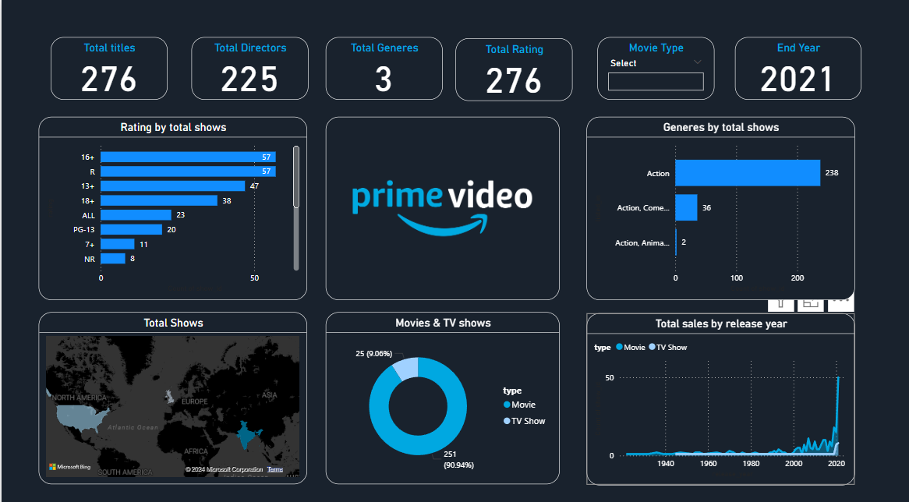

# Amazon_prime_PowerBi_Dashboard
This repository contains a dynamic Power BI dashboard for Amazon Prime data analysis. The dashboard provides various insights into the content available on Amazon Prime, including details on genres, ratings, release years, and more.

## Features

- **Date Range Filter**: Filter content based on the date it was added.
- **Country Filter**: Filter shows and movies by the country of origin.
- **Rating Filter**: Filter content based on ratings.
- **Genre Filter**: Filter content by genre categories.
- **Director and Cast Filters**: Filter shows and movies based on the director and cast members.
- **Duration Filter**: Filter content based on its duration.

- ## Slicers Implemented
 - **Movie**
 - ## Data Source

The dataset used in this dashboard includes the following columns:
- `show_id`
- `type`
- `title`
- `director`
- `cast`
- `country`
- `date_added`
- `release_year`
- `rating`
- `duration`
- `listed_in`
- `description`

